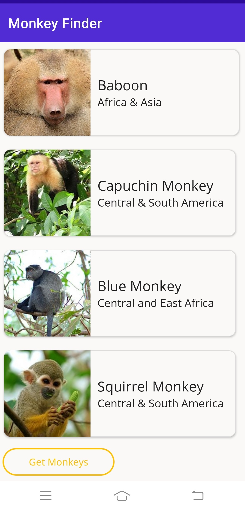

# Monkey Finder : DotNet MAUI Application
A cross platform Dotnet MAUI App that uses MVVM pattern to fetch and display monkey data from remote API. Following is a screen showing how data will be displayed.
 

The application is inspired by [Gerald Versluis](https://www.youtube.com/@jfversluis). Thank you for such a great content.

